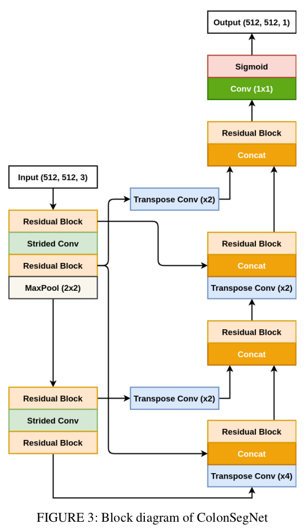
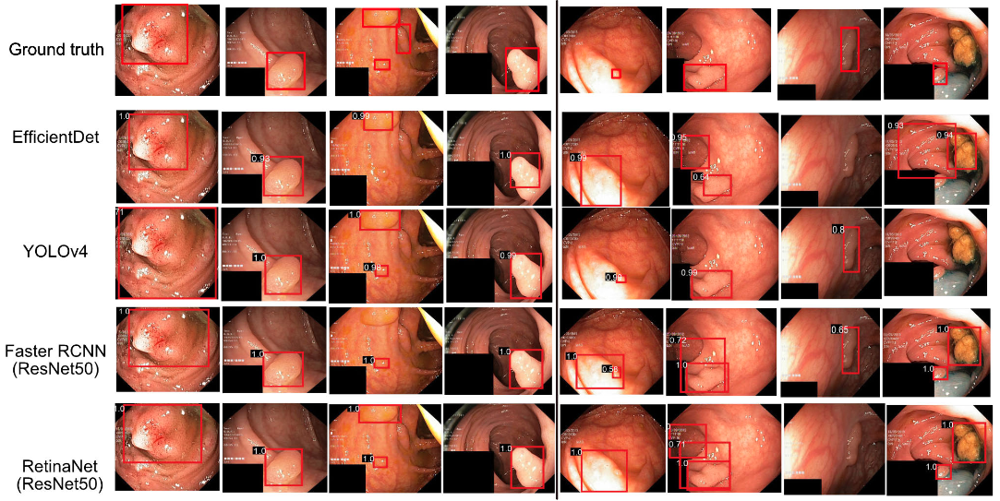
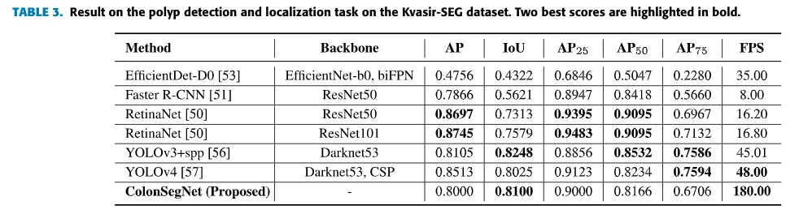
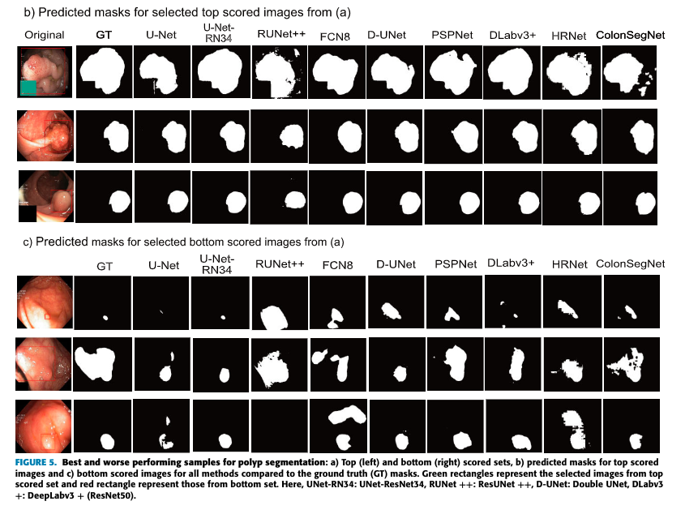
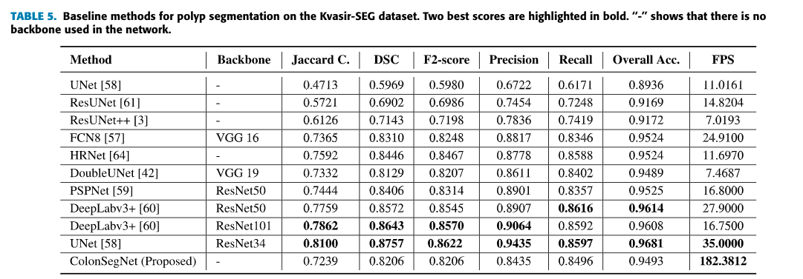

# Real-Time Polyp Detection, Localization and Segmentation in Colonoscopy Using Deep Learning
# ColonSegNet

ColonSegNet is an encoder-decoder that uses residual block with squeeze and excitation network as the main component. The network is designed to have very few trainable parameters as compared to other networks baseline networks such as U-Net, PSPNet, DeepLabV3+, and others.  The use of fewer trainable parameters makes the proposed architecture a very light-weight network that leads to real-time performance.

[Real-Time Polyp Detection, Localization and Segmentation in Colonoscopy Using Deep Learning](access.pdf).

## Architecture

## How to run
Please run the files in the following sequence:
1. data_aug.py - Change the dataset path. This will create a new_data folder containing augmented data.
2. train.py - If you want to use augmented data from the new_data folder then uncomment the lines from 70-74 and comment the lines 76 and 77.
3. test.py - Set the proper path for the dataset in line number 55 and run the code. This will provide the scores of different evaluation metrics as well as masks which are saved in the "results" folder.

## Dataset:
You can download the Kvasir-SEG from here: [https://datasets.simula.no/downloads/kvasir-seg.zip](https://datasets.simula.no/downloads/kvasir-seg.zip)

## Scripts for bounding boxes
### Note: ColonSegNet is not an end to end network for polyp detection. Basically, it is a segmentation network. We have converted the ground truth masks into bounding boxes. The link for the script can be found below: 
[https://github.com/sharibox/EAD2019/tree/master/fileFormatConverters](https://github.com/sharibox/EAD2019/tree/master/fileFormatConverters)

### TensorFlow implementation of ColonSegNet
[https://github.com/nikhilroxtomar/Semantic-Segmentation-Architecture/blob/main/TensorFlow/colonsegnet.py](https://github.com/nikhilroxtomar/Semantic-Segmentation-Architecture/blob/main/TensorFlow/colonsegnet.py)

## Results

## Citation
Please cite our paper if you find the work useful: 
<pre>
@article{jha2021real,
  title={Real-Time Polyp Detection, Localization and Segmentation in Colonoscopy Using Deep Learning},
  author={Jha, Debesh and Ali, Sharib and Tomar, Nikhil Kumar and Johansen, H{\aa}vard D and Johansen, Dag and Rittscher, Jens and Riegler, Michael A and Halvorsen, P{\aa}l},
  journal={Ieee Access},
  volume={9},
  pages={40496--40510},
  year={2021}
}
</pre>

## Contact
Please contact debesh@simula.no and nikhilroxtomar@gmail.com for any further questions.
