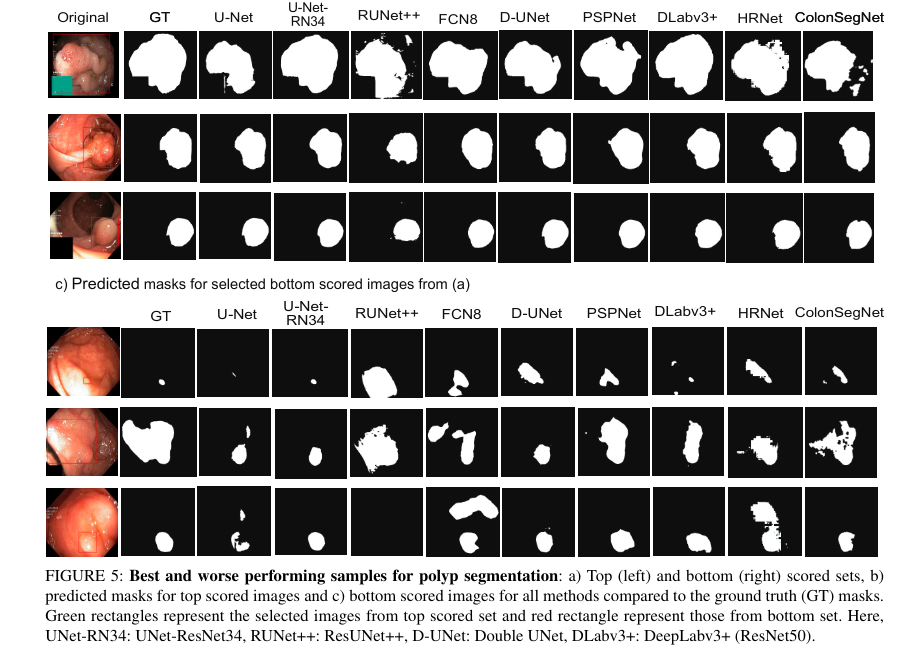
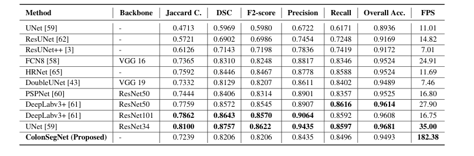

# Real-Time Polyp Detection, Localisation and Segmentation in Colonoscopy Using Deep Learning
# ColonSegNet

ColonSegNet is an encoder-decoder that uses residual block with squeeze and excitation network as the main component. The network is designed to have very few trainable parameters as compared to other networks baseline networks such as U-Net, PSPNet, DeepLabV3+, and others.  The use of fewer trainable parameters makes the proposed architecture a very light-weight network that leads to real-time performance.

[Real-Time Polyp Detection, Localisation and Segmentation in Colonoscopy Using Deep Learning](access.pdf).

## Architecture

## Requirements:
	os
	numpy
	cv2
	tensorflow
	glob
	tqdm

## Results

## Citation
Please cite our paper if you find the work useful: 
<pre>
@article{jha2021real,
  title={Real-Time Polyp Detection, Localization and Segmentation in Colonoscopy Using Deep Learning},
  author={Jha, Debesh and Ali, Sharib and Tomar, Nikhil Kumar and Johansen, H{\aa}vard D and Johansen, Dag and Rittscher, Jens and Riegler, Michael A and Halvorsen, P{\aa}l},
  journal={Ieee Access},
  volume={9},
  pages={40496--40510},
  year={2021},
  publisher={IEEE}
}
</pre>

## Contact
Please contact debesh@simula.no for any further questions.
